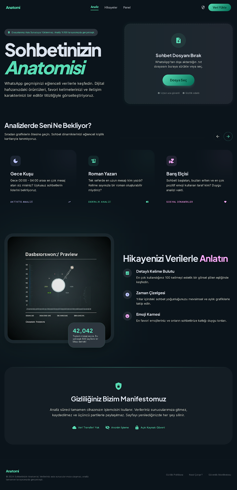
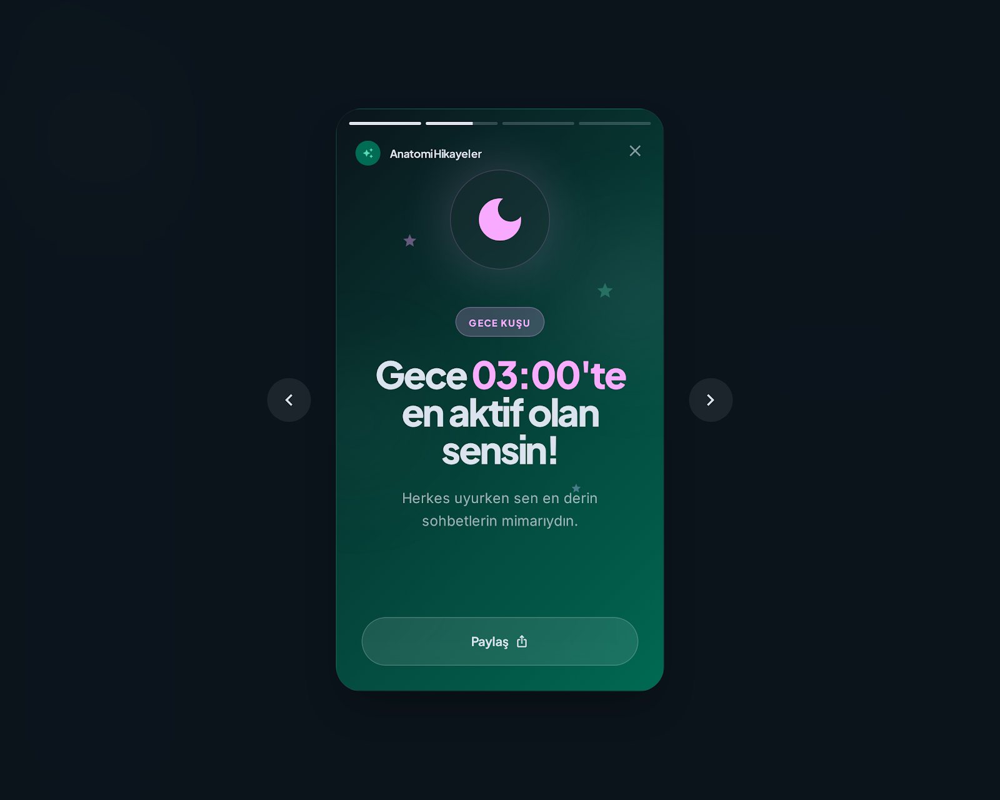

<p align="center">
  
</p>

<h1 align="center">🧬 Anatomi — WhatsApp Chat Analyzer</h1>

<p align="center">
  <strong>Turn your WhatsApp conversations into beautiful, data-driven stories.</strong><br/>
  A "Spotify Wrapped" style analysis experience for your chat history.
</p>

<p align="center">
  
  
  
  
  
</p>

<p align="center">
  <a href="https://anatomi.alidari.dev" target="_blank">
    
  </a>
</p>

---

## 📖 About

**Anatomi** is a full-stack WhatsApp chat analysis platform that transforms exported `.txt` chat files into engaging, visually rich insights. Inspired by Spotify Wrapped, it reveals hidden patterns in your conversations — from personality archetypes to emotional timelines.

The platform consists of three main parts:
- 🌐 **Web App** — Editorial-design React dashboard with glassmorphism UI
- 📱 **Mobile App** — Native Android app (React Native / Expo) with Google Play integration
- ⚙️ **Backend API** — FastAPI server with NLP pipeline, async job queue, and SQLite storage

<p align="center">
  
</p>

---

## ✨ Key Features

### 🔍 Analysis Engine
| Feature | Description |
|---|---|
| **Vibe Check** | Overall mood classification (Romantic, Toxic, Chaotic, Chill, Balanced) using hybrid BERT + VADER sentiment analysis |
| **Tension Index** | Aggression meter (0-100) detecting CAPS LOCK abuse, spam bursts, and negative language patterns |
| **Night Owl / Early Bird** | Who texts at 3 AM? 24-hour heatmap with per-sender breakdown |
| **Response Time Analysis** | Average reply speed, ghosting counter, and "Seen Champion" detection |
| **Streak Tracker** | Longest consecutive days of chatting, activity rate percentage |
| **Word Cloud** | Top 100 words filtered with Turkish stopwords, visualized per sender |
| **Emoji Report Card** | Most-used emojis ranked by frequency with mood correlation |
| **Peace Ambassador** | Who apologizes more? Tracks 30+ Turkish apology phrases |
| **Personality Archetypes** | "Night Owl", "Novel Writer", "Peace Ambassador", "Drama Queen", "Ice Fridge" |

### 🧠 NLP & Machine Learning
- **Primary Model:** [`savasy/bert-base-turkish-sentiment-cased`](https://huggingface.co/savasy/bert-base-turkish-sentiment-cased) — fine-tuned Turkish BERT for context-aware sentiment
- **Fallback:** VADER + TextBlob hybrid scoring with Turkish keyword dictionaries
- **Batch Inference:** Processes 2,000-message samples with proportional sender sampling

### 🎨 Story Mode
Instagram Stories-style swipeable cards that present your analysis as a visual narrative — shareable screenshots with animated transitions and gradient backgrounds.

### 📱 Mobile-First
- Native Android app built with **Expo SDK 54** and **React Native 0.81**
- In-app purchases (Google Play Billing) for premium features
- AdMob integration with rewarded ads for free-tier users
- Push notifications via Expo when analysis completes
- OTA updates via EAS Update

---

## 🏗️ Architecture

```
whatsapp_analyzer/
├── backend/                  # FastAPI + Python NLP engine
│   ├── app/
│   │   ├── main.py           # API endpoints, async job queue, CORS
│   │   ├── analyzer.py       # 1,500+ lines of NLP analysis logic
│   │   ├── parser.py         # WhatsApp chat format parser (multi-locale)
│   │   └── database.py       # SQLAlchemy + SQLite persistence layer
│   ├── Dockerfile
│   └── requirements.txt
├── frontend/                 # React 19 + Vite 8 + TailwindCSS 4
│   ├── src/
│   │   ├── components/       # 18 React components (Dashboard, StoryMode, etc.)
│   │   └── App.jsx           # Main app with routing and state management
│   ├── Dockerfile
│   └── nginx.conf            # Production reverse proxy config
├── mobile/                   # React Native (Expo) Android app
│   ├── app/                  # Expo Router file-based routing
│   ├── components/           # Ads, Subscriptions, Alerts
│   └── lib/                  # API client, storage, color system
├── docker-compose.yml        # One-command deployment
└── start.sh                  # Local development launcher
```

---

## 🚀 Getting Started

### Prerequisites
- Python 3.10+
- Node.js 18+
- (Optional) Docker & Docker Compose

### Local Development

```bash
# Clone the repository
git clone https://github.com/Alidari/whatsapp-analyzer.git
cd whatsapp-analyzer

# Start both backend and frontend
chmod +x start.sh
./start.sh
```

This launches:
- **Backend** at `http://localhost:8000` (API docs at `/docs`)
- **Frontend** at `http://localhost:5173`

### Manual Setup

**Backend:**
```bash
cd backend
python -m venv venv
source venv/bin/activate
pip install -r requirements.txt
uvicorn app.main:app --host 0.0.0.0 --port 8000 --reload
```

**Frontend:**
```bash
cd frontend
npm install
npm run dev
```

### Docker Deployment

```bash
docker-compose up --build
```

---

## 🛡️ Privacy & Security

- **Client-side first:** The web version processes files in the browser before sending to the API
- **No permanent storage:** Chat files are never saved to disk — analysis runs in-memory
- **Rate limited:** 5 requests/minute per IP via SlowAPI
- **API key protected:** All endpoints require `X-API-Key` header validation
- **GDPR compliant:** Full data deletion endpoint (`DELETE /api/user/data`)

---

## 📡 API Endpoints

| Method | Endpoint | Description |
|--------|----------|-------------|
| `POST` | `/api/analyze` | Upload `.txt` or `.zip` chat file, returns `job_id` |
| `GET` | `/api/status/{job_id}` | Poll analysis progress (queued → parsing → NLP → done) |
| `GET` | `/api/history` | List user's past analyses |
| `GET` | `/api/history/{id}` | Get full analysis results |
| `DELETE` | `/api/history/{id}` | Delete an analysis |
| `PATCH` | `/api/history/{id}/rename` | Rename an analysis |
| `POST` | `/api/verify-subscription` | Google Play subscription verification |
| `GET` | `/api/health` | Health check |

Full interactive docs available at `/docs` (Swagger UI).

---

## 🧰 Tech Stack

| Layer | Technology |
|-------|-----------|
| **Backend** | Python 3.10, FastAPI, Pandas, VADER, TextBlob, HuggingFace Transformers |
| **Frontend** | React 19, Vite 8, TailwindCSS 4, Framer Motion, Recharts, Radix UI |
| **Mobile** | React Native 0.81, Expo SDK 54, Expo Router, React Native IAP |
| **Database** | SQLAlchemy + aiosqlite (SQLite) |
| **Deployment** | Docker Compose, Nginx reverse proxy |
| **Monetization** | Google Play Billing (IAP), AdMob (rewarded ads) |

---

## 📸 Screenshots

<p align="center">
  
  &nbsp;&nbsp;
  
</p>

---

## 📄 License

This project is proprietary. All rights reserved.

---

<p align="center">
  Built with ☕ and 🧬 by <a href="https://github.com/Alidari">Ali Dari</a>
</p>
